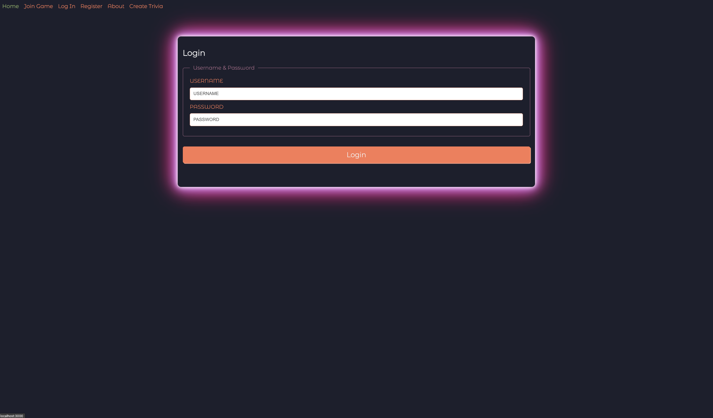

# The Peanut Gallery - The remote access game room!

## About this Project

This app was designed to allow people from all over the world to join in the fun with friends and colleagues. Simply create an account, load a trivia set of your choice, and then send a code to all of your friends that want to play. This app was built with **simplicity** in mind, meaning players simply enter a 4-digit code to enter the game room. There is no need to register unless you want to be the host! The Peanut Gallery utilizes Socket.io to allow players to respond in real time with our server, players will know how they scored immediately!

## Built With

- HTML5
- CSS3
- JavaScript/jQuery/JSON
- MongoDB
- Express
- React.js
- Git/Github - Github Pages for Hosting
- Heroku & Netlify Deployment
- Socket.io

## Screenshots

## Getting Started

[Click here](https://thepeanutgallery.netlify.app/) to visit the deployed app!

## Future Enhancements

- The addition of games other than just trivia.
- The addition of more players per game room. (Currently limited to 4 per room)

## Acknowledgements

We would like to thank all of your friends and family for supporting this project. Especially considering the short window of time to produce. Many stressful evenings working through code would not be possible without your support!

## Contributors

Dustin Greyfield, Elaine Brossa, Claudia Uhr, Mickey Mangan
